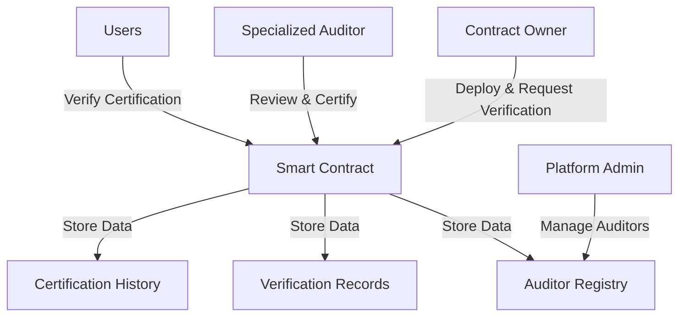

# Timelock-Init: Smart Contract Verification Platform

A robust verification platform for smart contracts with timelock mechanisms on the Stacks blockchain, providing comprehensive security assessments and transparent certification processes.

## Overview

Timelock-Init offers a comprehensive framework for:
- Verifying smart contracts with timelock components
- Managing auditor registrations and trust scores
- Tracking contract certification history
- Enabling transparent contract verification
- Creating immutable audit trails

The platform bridges the security gap between contract developers and users by providing rigorous, verifiable certifications.

## Architecture



### Core Components
- **Timelock Auditor Registry**: Manages specialized timelock auditors
- **Verification System**: Handles contract review requests
- **Certification Engine**: Issues and tracks contract certifications
- **Historical Tracking**: Maintains comprehensive audit records

## Contract Documentation

### timelock-verification.clar

The core contract managing timelock contract verification.

#### Key Features
- Specialized auditor management
- Timelock contract certification
- Comprehensive verification endpoints
- Trust score tracking
- Immutable audit history

#### Access Control
- Platform Admin: Auditor management
- Specialized Auditors: Certification
- Public Users: Verification queries
- Contract Owners: Certification requests

## Getting Started

### Prerequisites
- Clarinet
- Stacks wallet
- Understanding of timelock mechanisms

### Basic Usage

1. **Request Verification**
```clarity
(contract-call? 
  .timelock-verification 
  request-certification 
  contract-principal 
  "1.0.0" 
  "Timelock contract description" 
  "https://github.com/repo")
```

2. **Verify Contract**
```clarity
(contract-call? 
  .timelock-verification 
  verify-contract 
  contract-principal 
  "1.0.0")
```

## Function Reference

### Public Functions

#### Auditor Management
```clarity
(apply-as-timelock-auditor name expertise website credentials)
(approve-auditor auditor)
(update-auditor-status auditor new-status)
```

#### Verification
```clarity
(request-certification contract-id version description repository-url)
(issue-certification contract-id version security-rating audit-report-url valid-until notes)
(verify-contract contract-id version)
```

## Development

### Testing
1. Initialize Clarinet environment
```bash
clarinet new timelock-init
```

2. Deploy contracts
```bash
clarinet console
```

### Local Setup
1. Clone repository
2. Install dependencies
3. Configure Clarinet
4. Deploy verification contracts

## Security Considerations

### Best Practices
- Thoroughly verify timelock contract mechanisms
- Check auditor specialization and reputation
- Validate certification comprehensiveness
- Use detailed verification endpoints

### Limitations
- Certifications have time constraints
- Auditor expertise varies
- Certification isn't a vulnerability guarantee
- Depends on auditor quality and depth of review

### Risk Mitigation
- Seek multiple specialized auditor reviews
- Perform periodic recertification
- Monitor auditor trust scores
- Analyze comprehensive certification history